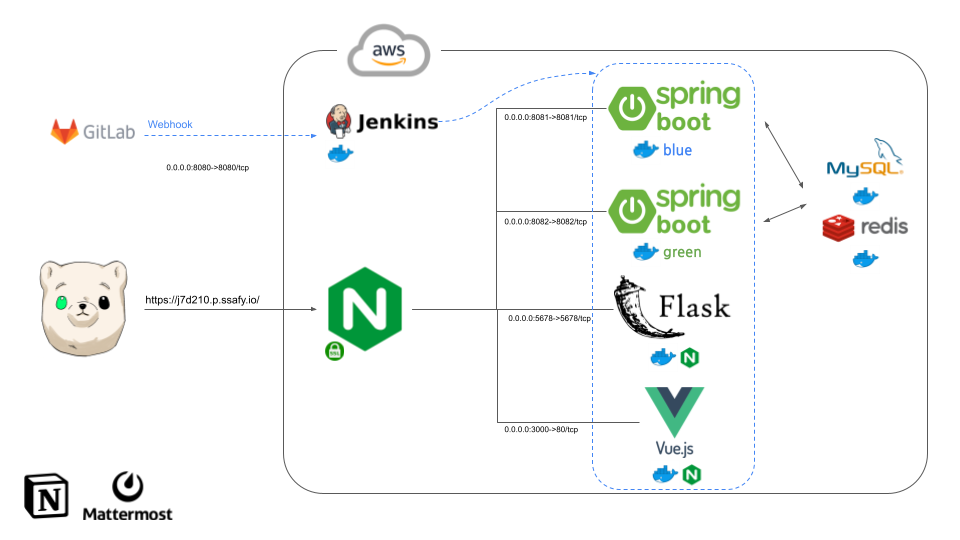
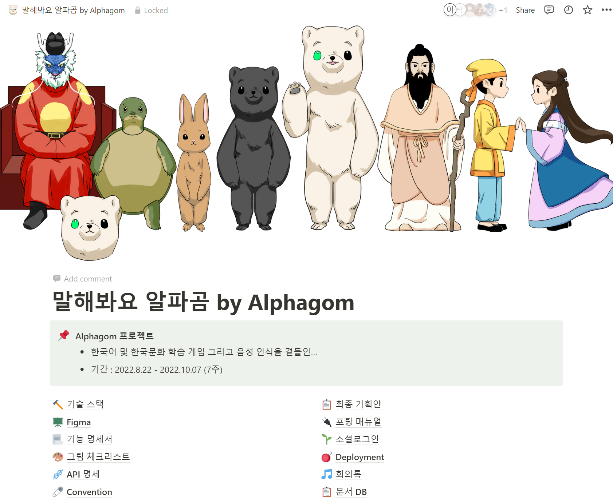
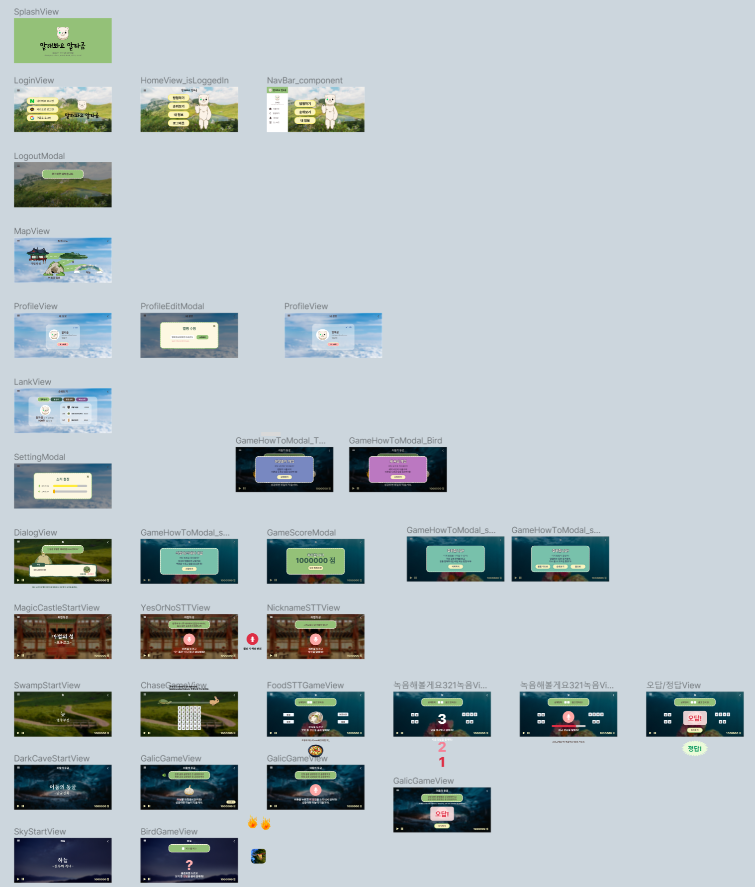

# 말해봐요, 알파곰

## 기획 배경
맞벌이 가구는 현대 사회에 들어와 그 비중이 꾸준히 커지고 있습니다. 

그에 따라 맞벌이 가구 내에서는 아이 돌봄과 교육에 빈틈이 생길 수 밖에 없는 상황이 오게 되었습니다. 
'말해봐요, 알파곰'은 한국어 및 한국 문화 학습을 위한 아동용 게임 어플리케이션으로,  맞벌이 가정 내 생긴 교육의 빈틈을 아이들이 보다 흥미를 가질 수 있는 방식으로 메워줄 것입니다.
게임은 주로 음성을 활용한 게임 캐릭터와의 대화를 통해 진행이 되고, 이를 통해 어휘구사 및 이해 능력 향상과 함께 아이들의 학습에 적합한 쉽고 재미있는 방식으로 한국 문화에 대한 이해도 증진 또한 도모할 수 있습니다.

## 주요 서비스 화면
## 주요 기술 스택
### Frontend
- vue3
- html5
- css3

### Backend
- Redis
- MySQL
- Springboot
- Spring Security
- JWT
- JPA
- Flask
- 
### Infra
- AWS EC2
- Jenkins
- Nginx
- Docker
- FFMPEG

### ETC
- Figma
- Notion
- JIRA
- GitLab
- Mattermost

## 아키텍쳐


## 프론트 구조
```
src/
├── App.vue
├── api
│   └── api.ts
├── assets
├── components
│   ├── BackButton.vue
│   ├── BackGroundMusic.vue
│   ├── NavBar.vue
│   ├── TopViewTitle.vue
│   └── game
│       ├── BGDarkCave.vue
│       ├── BGMagicCastle.vue
│       ├── BGSky.vue
│       ├── BGSwamp.vue
│       ├── CommonDialog.vue
│       ├── MicRecord.vue
│       ├── PassorFail.vue
│       ├── PlayBar.vue
│       └── Score.vue
├── main.ts
├── router
│   ├── authRouter.ts
│   ├── gameRouter.ts
│   └── index.ts
├── stores
│   ├── auth.ts
│   ├── bg.ts
│   ├── game.ts
│   ├── modal.ts
│   ├── rank.ts
│   ├── setting.ts
│   └── tutorial.ts
├── utils.js
└── views
    ├── Auth
    │   ├── LoginView.vue
    │   └── OAuthRedirectView.vue
    ├── DarkCave
    │   ├── DarkCaveDialogView.vue
    │   ├── DarkCaveStartView.vue
    │   └── TongueTwisterGameView.vue
    ├── Epilogue
    │   ├── EpilogueDialogView.vue
    │   └── EpilogueEndView.vue
    ├── HomeView.vue
    ├── MagicCastle
    │   ├── MagicCastleDialogView.vue
    │   ├── MagicCastleStartView.vue
    │   └── MagicCastleTutorialView.vue
    ├── MapView.vue
    ├── Modal
    │   ├── EpilogueModal.vue
    │   ├── GameScoreModal.vue
    │   ├── HowTo
    │   │   ├── BirdProverbGameModal.vue
    │   │   ├── KingCureGameModal.vue
    │   │   └── TongueTwisterGameModal.vue
    │   ├── MagicCastleEndModal.vue
    │   ├── MyPageUpdateModal.vue
    │   └── SettingModal.vue
    ├── MyPageView.vue
    ├── NotFound404.vue
    ├── RankView.vue
    ├── SettingView.vue
    ├── Sky
    │   ├── BirdProverbGameView.vue
    │   ├── SkyDialogView.vue
    │   └── SkyStartView.vue
    ├── StageChangeView.vue
    └── Swamp
        ├── ChaseGameView.vue
        ├── KingCureGameView.vue
        ├── SwampDialogView.vue
        └── SwampStartView.vue
```

## 개발 기간 및 팀원 역할 소개

### 개발 기간
2022-08-22 ~ 2022-10-07 (약 7주)
### 팀원
<table>
    <tr>
        <td height="140px" align="center"> <a href="https://github.com/spaceforvincent">
             <br>최혁주</a> <br>
        </td>
        <td height="140px" align="center"> <a href="https://github.com/hyehye66">
             <br>배근혜</a> <br>
        </td>
        <td height="140px" align="center"> <a href="https://github.com/mhlee21">
             <br>이미현</a> <br>
        </td>
        <td height="140px" align="center"> <a href="https://github.com/Gyeong10">
             <br>박경열</a> <br>
        </td>
        <td height="140px" align="center"> <a href="https://github.com/Hyunbird">
             <br>이현정</a> <br>
        </td>
        <td height="140px" align="center"> <a href="https://github.com/kettle4ot">
             <br>김수빈</a> <br>
        </td>
    </tr>
    <tr>
        <td align="center">
        팀장/AI
        </td>
        <td align="center">
        팀원/AI
        </td>
        <td align="center">
        팀원/Back-End
        </td>
        <td align="center">
        팀원/Back-End
        </td>
        <td align="center">
        팀원/Front-End
        </td>
        <td align="center">
        팀원/Front-End
        </td>
    </tr>
</table>

### 역할분담

[](https://github.com/spaceforvincent)

[](https://github.com/hyehye66)

[](https://github.com/mhlee21)

[](https://github.com/Gyeong10)

[](https://github.com/Hyunbird)

[](https://github.com/kettle4ot)


## 프로젝트 산출물
### Notion
['말해봐요 알파곰' 노션 바로가기](https://aboutvincent.notion.site/by-Alphagom-4fa3f449533243bca058a64bd3925011)



### Mockup
